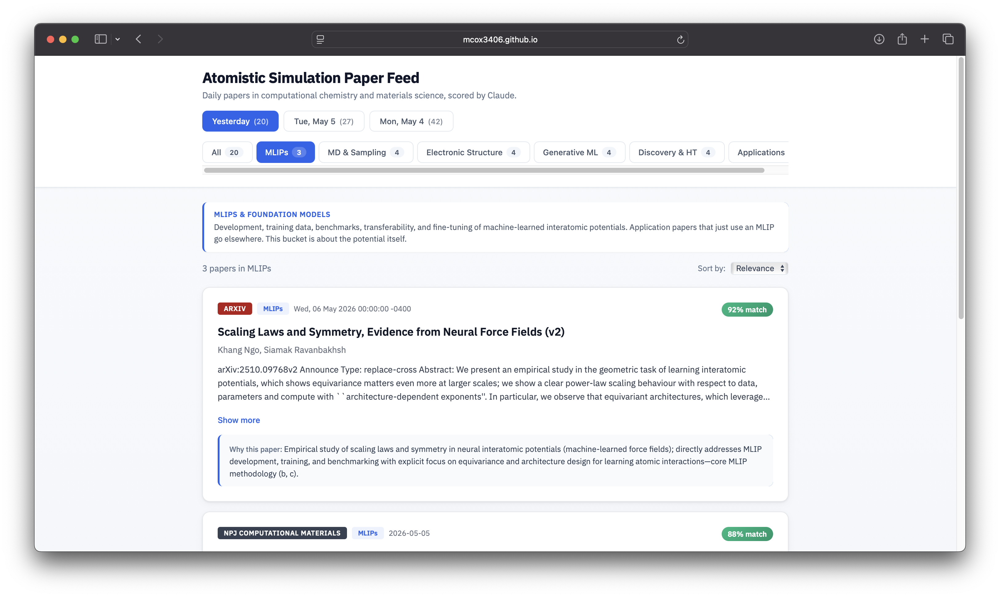

# Atomistic Simulation Paper Feed

A daily feed of papers in computational chemistry, materials science, and atomistic ML. Sources include arXiv, bioRxiv, ChemRxiv, OpenReview workshops, and major journal RSS (Nature/Science families, JACS, JCTC, JCIM, ACS Catalysis, Digital Discovery, Chem. Sci., PCCP, Angew., npj Comp. Mat., Patterns, etc.). A simple keyword pre-filter trims the volume, and Claude then scores each candidate for relevance and assigns it to one of six buckets. Hits are posted to Slack and committed as JSON for the static site.

Live at **[mcox3406.github.io/atomistic-simulation-paper-feed](https://mcox3406.github.io/atomistic-simulation-paper-feed/)**.



Adapted from [`lab-paper-feed`](https://github.com/mcox3406/lab-paper-feed).

## Setup

1. Add GitHub Actions secrets: `ANTHROPIC_API_KEY`, `SLACK_WEBHOOK_URL`, `OPENREVIEW_USERNAME`, `OPENREVIEW_PASSWORD`.
2. Edit `config.json`. The important knobs are `lab_description` (what Claude scores against), `keywords` (cheap pre-filter, never seen by the LLM), `relevance_threshold`, and `min_impact_factor`.
3. Edit `key_authors.json` to flag authors who should bypass the LLM filter.
4. Trigger the **Daily Paper Feed** workflow manually once, or wait for the 12:00 UTC cron.
5. For the site: Settings -> Pages -> Source: GitHub Actions. The deploy workflow rebuilds on every successful feed run.

## Local dev

Set up a virtualenv, install deps, and run the pipeline against a small slice without posting to Slack:

```bash
uv venv && source .venv/bin/activate
uv pip install -r requirements.txt
cp .env.example .env   # fill in keys
uv run python run.py --dry-run --test   # 50-paper smoke test, no Slack
uv run python run.py --sync-history     # mark currently fetchable papers as seen, no LLM
```

For the frontend, install Node deps and start the Vite dev server (it reads whatever JSON is already in `frontend/public/data/papers/`):

```bash
cd frontend && npm install && npm run dev
```

## Contributing

PRs welcome and very much appreciated. Some easy ways to help:

- **Key authors** (`key_authors.json`): add anyone whose papers should always surface.
- **Fetchers** (`paper_filter/fetchers/`): add a new source or fix a flaky feed.
- **Styling** (`frontend/src/App.jsx`): the UI is plain inline-style React, easy to tweak.
- **Categorizer prompt** (`paper_filter/filters/categorizer.py`): if a category is mis-bucketing, tighten the prompt.

If you change the category list, update both `paper_filter/filters/categorizer.py` and `frontend/src/App.jsx` so they stay in sync.

## Layout

```
config.json              domain description, keywords, sources, threshold
key_authors.json         bypass-the-LLM list
posted_papers.json       dedup history (committed by Actions)
run.py                   CLI entry point
paper_filter/
  fetchers/              arxiv, biorxiv, chemrxiv, journals, openreview
  filters/               keyword + LLM scoring + categorization
  slack.py               webhook posting
  json_export.py         writes data files for the frontend
  pipeline.py            orchestration
frontend/
  src/                   React app
  public/data/papers/    JSON written by the pipeline (committed)
.github/workflows/       daily-feed.yml, deploy-pages.yml
```
